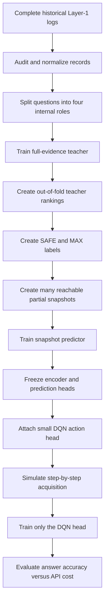
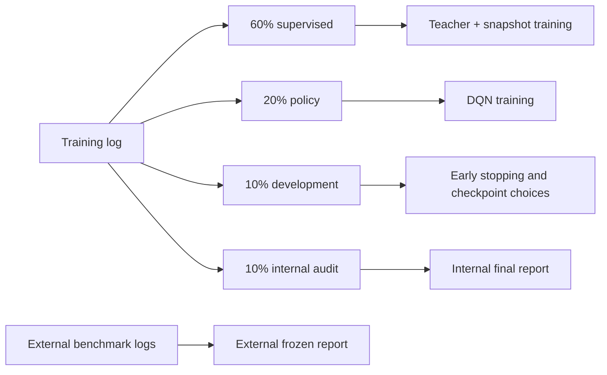
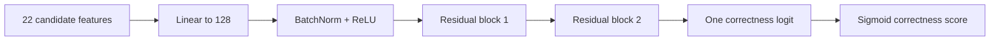
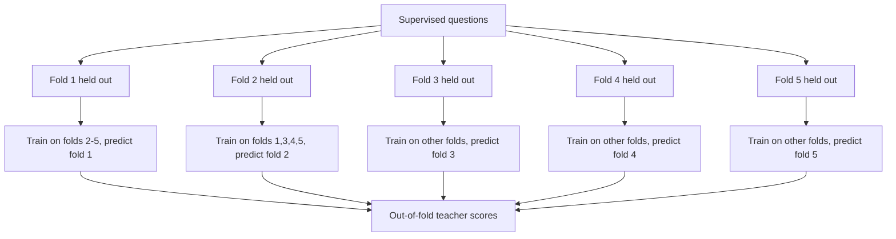
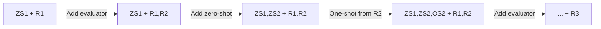
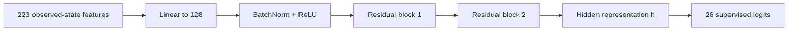
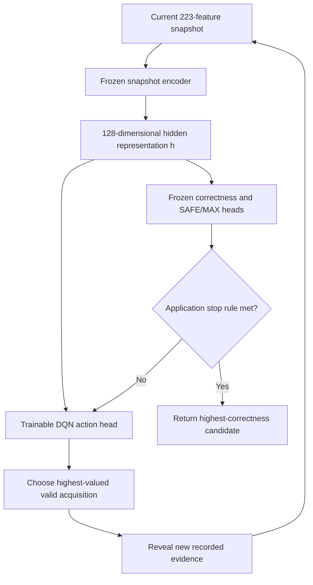
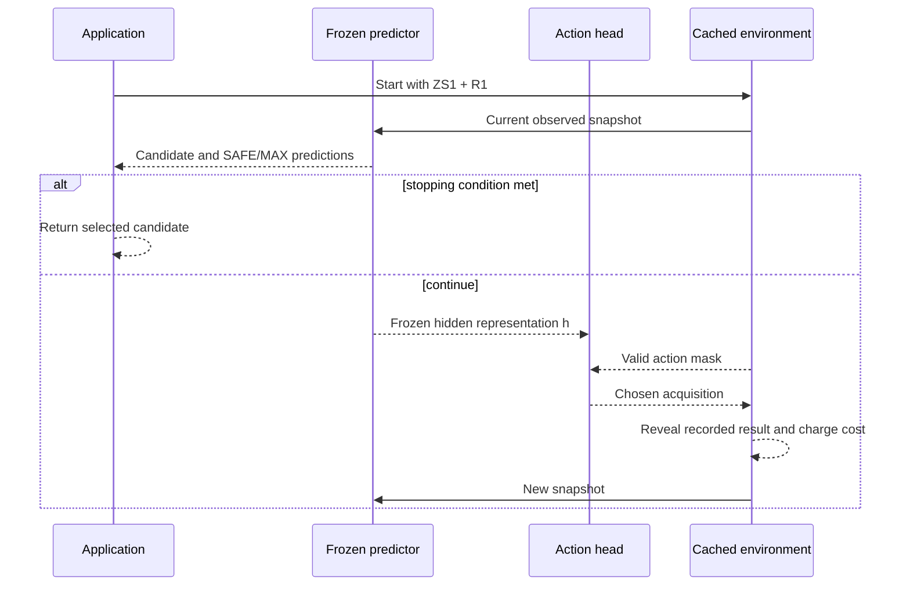
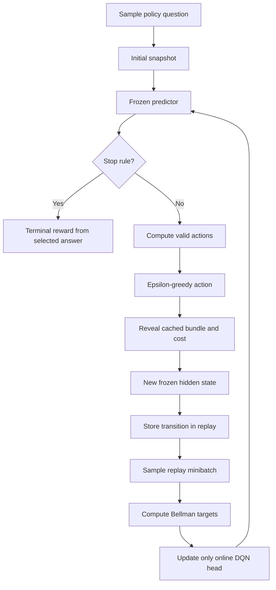

# Adaptive Analogical Training: A Simple, Complete Guide

This guide explains the workflow implemented in:

- `adaptive_analogical_training_kaggle.ipynb`: the self-contained Kaggle notebook you run.
- `adaptive_analogical_training.py`: the same implementation as a normal Python module.
- `test_adaptive_analogical_training.py`: offline checks for the data contract, costs, masks, frozen network, RL targets, saving, and resume behavior.

The workflow has two connected goals:

1. Select the candidate solution that is most likely to be correct.
2. Avoid paying for every possible candidate and every possible CCS evaluation when the system already has enough evidence.

The first goal is a supervised-learning problem. The second goal is a sequential decision problem, so the code uses a small reinforcement-learning head.

No API calls are made during notebook training. The notebook simulates candidate and evaluator acquisition by gradually revealing measurements that already exist in the `_run_log.json` files.

> **Current validation boundary:** the code has passed offline and synthetic tests. It has not yet completed a real full Kaggle training run on the five configured logs. Metrics printed by a future Kaggle run will be the experimental evidence.

---

## 1. The central idea

For one target question, the existing Layer-1 experiment has:

- Three zero-shot candidate solutions.
- Five retrieved solved examples.
- One candidate solution generated from each retrieved example.
- Five retrieved examples used as known-answer evaluators.
- Base-CCS for each evaluator.
- CCS for every candidate-evaluator pair.
- The true correctness label of each candidate, available only for offline training and evaluation.

That gives eight candidates and five evaluators.

The old fixed-budget approach collects the complete data and ranks all eight candidates. The adaptive workflow asks a second question after every partial stage:

> Do we already have enough evidence to return an answer? If not, which candidate or evaluator should we acquire next?

The entire workflow is:



There are therefore three learned models or stages:

| Stage | Learns | Sees | Main purpose |
|---|---|---|---|
| Full-evidence teacher | Candidate correctness score | Complete 8-candidate, 5-evaluator evidence | Produce a strong ranking and SAFE/MAX training labels |
| Snapshot predictor | Correctness and SAFE/MAX information | Only evidence acquired at the current stage | Understand incomplete states |
| DQN action head | Value of each valid next acquisition | Frozen hidden representation of the current snapshot | Choose what to acquire next |

The application—not the DQN—decides when to stop. This separation is intentional.

---

## 2. What CCS and Base-CCS mean

Let the target question be `Q` and candidate solution `Ci`.

Let `Rj` be a retrieved question with a known reference answer. We can use `Rj` as an evaluator because we know whether the model solves it correctly.

### Base-CCS

Base-CCS asks:

> How often can the solver answer evaluator `Rj` without seeing a candidate solution?

With five repeated attempts:

```text
Base-CCS(Rj) = correct baseline attempts / 5
```

### Candidate-conditioned CCS

CCS asks:

> How often can the solver answer evaluator `Rj` after seeing candidate `Ci` as an analogical demonstration?

```text
CCS(Ci, Rj) = correct conditioned attempts / 5
```

The five attempts produce a coarse value from:

```text
0.0, 0.2, 0.4, 0.6, 0.8, 1.0
```

The important research hypothesis is that the pattern of a candidate's CCS values contains evidence about whether that candidate is correct on the original target.

The code does **not** treat successful CCS as a proof that the reasoning is logically valid. The LLM can ignore, repair, or partially reuse a candidate. CCS is behavioral evidence under a particular model, prompt, temperature, and grading process.

### Why retain raw CCS and Base-CCS

The previous marginal rule was:

```text
max(0, CCS - Base-CCS)
```

This loses information when Base-CCS is already high. If Base-CCS is `1.0`, both of these become zero after clipping:

```text
Candidate A: CCS = 1.0 → max(0, 1.0 - 1.0) = 0
Candidate B: CCS = 0.2 → max(0, 0.2 - 1.0) = 0
```

Raw features still distinguish preservation from severe degradation. The neural network can learn whether that distinction predicts target correctness.

---

## 3. What one normalized training record contains

The loader reads each `_run_log.json` record and converts it into a compact `Record` object.

```text
Record
├── uid                  unique benchmark + original question index
├── group                normalized question-text hash
├── benchmark            source filename stem
├── candidate_ids[8]
├── evaluator_ids[5]
├── similarity[5]
├── baseline[5]
├── ccs[8, 5]
└── labels[8]            real candidate correctness, used offline only
```

Candidate slots have a fixed meaning:

```text
Slot 0: ZS1
Slot 1: ZS2
Slot 2: ZS3
Slot 3: one-shot candidate from retrieved source 1
Slot 4: one-shot candidate from retrieved source 2
Slot 5: one-shot candidate from retrieved source 3
Slot 6: one-shot candidate from retrieved source 4
Slot 7: one-shot candidate from retrieved source 5
```

Evaluator slots follow retrieval order from most similar to least similar among the stored top five.

This slot order is decided without looking at candidate correctness. The teacher's later ranking is never used to arrange input slots.

### Strict record eligibility

The first version uses complete records. A record is excluded and counted when it has problems such as:

- The wrong number of retrieved evaluators.
- Missing or duplicated evaluator IDs.
- The wrong number of zero-shot or one-shot candidates.
- A candidate generation failure.
- An unknown or failed target correctness label.
- A missing Base-CCS or CCS entry.
- A non-finite or out-of-range measurement.
- Rates incompatible with the configured number of repeated attempts.
- A duplicate target ID or exact normalized-text overlap.

This strictness simplifies the first experiment. Missing data are not silently converted into measured zeroes.

All-wrong candidate pools are retained. They matter because a selector cannot succeed when none of its available answers are correct, and dropping them would inflate accuracy.

The loader streams large JSON logs with `ijson`, so it does not need to load multi-gigabyte execution traces into memory. After normalization it saves `compact_records.pt`, which makes later notebook reruns faster.

---

## 4. The four internal data roles

Only the configured training file is divided into internal roles. The default split is:

| Role | Default fraction | Used for |
|---|---:|---|
| `supervised` | 60% | Teacher cross-fitting and snapshot-network training |
| `policy` | 20% | DQN interaction and updates |
| `dev` | 10% | Early stopping, heuristic selection, calibration, RL checkpoint selection |
| `audit` | 10% | Final internal evaluation after choices are frozen |

External benchmark files are never used by this new workflow to select teacher epochs, snapshot epochs, heuristic variants, or DQN checkpoints.



Questions—not individual candidates or snapshots—are split. Every candidate, snapshot, and trajectory belonging to one question stays in the same role.

The `group` field is a hash of normalized question text. Exact text duplicates across files are removed. This does not prove that there are no paraphrases or near duplicates; that requires a separate contamination audit.

The historical external benchmarks already influenced earlier research. The new code avoids using them for current checkpoint selection, but it cannot make their historical use disappear. That should be disclosed in the paper.

---

## 5. Stage 1: the full-evidence teacher

The teacher is the improved version of the original neural-ranking experiment. It sees the complete evidence for one candidate at a time.

### Teacher input

For each candidate, the teacher creates 22 features:

```text
[is_zero_shot, source_similarity,
 evaluator_similarities[5],
 evaluator_Base_CCS[5],
 candidate_CCS_row[5],
 source_parent_one_hot[5]]
```

The dimension is:

```text
2 + 5 + 5 + 5 + 5 = 22
```

For a zero-shot candidate:

- `is_zero_shot = 1`.
- `source_similarity = 0`.
- Its five parent indicators are zero.
- It still has five candidate-specific CCS values.

For a one-shot candidate generated from source 3:

- `is_zero_shot = 0`.
- `source_similarity` is the similarity of source 3.
- Parent one-hot position 3 is one.

### Teacher architecture

The teacher follows the structure of the original code:



A logit is an unrestricted real number. Applying sigmoid maps it to a value between zero and one. Candidates are ranked by this score.

The network is shared across candidates. It is not eight separate networks. Each candidate receives one output from the same learned function.

### Teacher loss

The true label is:

```text
1 = candidate's final answer was judged correct
0 = candidate's final answer was judged incorrect
```

The teacher uses binary cross-entropy with logits. In simple language, it is penalized when it assigns a high score to a wrong candidate or a low score to a correct candidate.

### Why the teacher uses cross-fitting

SAFE/MAX labels depend on the teacher's ranking. If we generate those labels from predictions on the same questions used to train the teacher, the rankings may be unrealistically good.

The supervised role is therefore divided into five folds by default:



Each training question is scored by a teacher that did not train on that question. These are called out-of-fold, or OOF, predictions.

Inside each fold training run, a portion of the remaining folds is used for early stopping. The external benchmarks are not used.

A final teacher is also trained on all supervised questions and uses the development role for early stopping. That final teacher supplies scores for policy, development, audit, and external records. OOF scores replace its scores for the supervised questions.

### Teacher reports

The compact report compares:

- Retrieval order.
- The best absolute heuristic chosen on development data.
- The best marginal heuristic chosen on development data.
- The ResNet teacher.

It prints Mean AP, Top-1 accuracy, and AP change. The same fixed heuristic choices are used for audit and external reports.

---

## 6. How SAFE and MAX labels are created

After sorting all eight candidates by the teacher score, the code looks at the real correctness labels.

Example:

```text
Teacher order: C1    C4    C5    C2     C3    C6     C8     C7
Real label:    True  True  True  False  True  False  False  False
```

SAFE is the leading uninterrupted correct prefix:

```text
SAFE = {C1, C4, C5}
```

The first false candidate ends the prefix, so `C3` is not SAFE even though it is correct.

MAX is the first teacher-ranked candidate only when SAFE is nonempty:

```text
MAX = C1
```

Edge cases:

| Teacher-ranked labels | SAFE | MAX |
|---|---|---|
| `False, True, True...` | Empty | Absent |
| `True, False, True...` | First candidate only | First candidate |
| All true | All candidates | First candidate |
| All false | Empty | Absent |

SAFE/MAX are retrospective supervised labels. They do not mean that the teacher score is a calibrated guarantee of certainty.

For every later partial snapshot, the complete-pool SAFE/MAX identity remains fixed. The code asks:

- Which currently existing candidates belong to SAFE?
- Is any SAFE candidate currently present?
- Is MAX currently present?

The labels are not recomputed from the smaller snapshot.

---

## 7. What a partial snapshot is

A snapshot is the state of the system after it has acquired only part of the full evidence.

The initial snapshot always contains:

- The first zero-shot candidate, `ZS1`.
- The top retrieved evaluator, `R1`.
- Base-CCS for `R1`.
- CCS between `ZS1` and `R1`.

Everything else is unknown at this stage.

Later snapshots might contain:

```text
Candidates: ZS1, ZS2, one-shot candidate from R1
Evaluators: R1, R2
Observed CCS: 3 candidates × 2 evaluators
```

### How states are stored

The application and RL simulator use `State`: a candidate mask and a retrieval-prefix evaluator count. This keeps their seven real actions unchanged.

Snapshot training also uses `SnapshotState`. It stores separate masks for candidates, retrieved samples, and active evaluators. Each retrieved sample can be unavailable, retrieved only, an evaluator only, a candidate source only, or both evaluator and candidate source. Thus a candidate from `R3` can exist while `R3` is not an evaluator, and `R3` can evaluate without its candidate existing. Measurement masks distinguish unattempted, attempted-but-unobserved, and observed calls.

### How snapshot training examples are generated

For every supervised question and each training epoch, the code creates a fresh set of snapshots. The default is 24 snapshots per question per epoch. About half come from the 186 states reachable by the current application. The rest cycle deterministically through a catalog of all 24,757 logically valid candidate/retrieval/evaluator structures. The catalog is shared; the code does not keep all 24,757 feature rows for every question in memory.



The RL/application side still follows valid actions: a one-shot candidate from source 4 is added only after source 4 becomes an evaluator. Snapshot-only augmentation can show source 4 retrieved and used for candidate generation without activating it as an evaluator. Both are physically coherent states, but only the first follows the current action interface.

Some training snapshots have real measurements hidden in structured patterns: a candidate row, evaluator column, individual cells, or all CCS. A hidden cell is either unattempted or marked attempted without an observed result. A small fraction of examples consistently permute zero-shot and retrieved-source slots, including values, masks, candidate provenance, and labels. No new CCS values or correctness labels are invented. Development snapshots are fixed and reachable for comparable epoch selection. Final snapshot diagnostics also include a separate fixed augmented-stress panel; this panel does not select epochs or RL checkpoints.

### One snapshot training row

One row contains:

```text
Input:  what is currently observed
Labels: correctness/SAFE/MAX information derived offline
```

Hidden future CCS values and hidden candidates are never included in the input.

Many snapshots can come from one question, but they are not independent questions. This is why the split happens before snapshot generation and evaluation uncertainty is computed over questions, not snapshot rows.

---

## 8. The 223 snapshot input features

The snapshot predictor needs to distinguish a measured zero from a missing value. Therefore every measurement has an explicit observation mask.

The default input has 223 numbers:

| Feature group | Shape | Count | Meaning |
|---|---:|---:|---|
| Candidate present | `8` | 8 | Which candidate slots currently exist |
| Candidate source one-hot | `8 × 6` | 48 | Zero-shot or one of five sources |
| Generation ordinal | `8` | 8 | Stable candidate-slot position for existing candidates |
| Retrieved sample present | `5` | 5 | Source is available, regardless of evaluator use |
| Evaluator active | `5` | 5 | Which evaluator slots currently exist |
| Similarity | `5` | 5 | Observed similarities for retrieved samples |
| Similarity observed mask | `5` | 5 | Separates missing similarity from measured zero |
| Base-CCS | `5` | 5 | Measured baselines for active evaluators |
| Base observed mask | `5` | 5 | Separates missing from measured zero |
| Baseline attempt mask | `5` | 5 | Separates failed or missing results from unattempted calls |
| CCS values | `8 × 5` | 40 | Observed candidate-evaluator rates |
| CCS observed mask | `8 × 5` | 40 | Separates missing from measured zero |
| CCS attempt mask | `8 × 5` | 40 | Separates failed or missing results from unattempted calls |
| Global context | `4` | 4 | Spent budget, remaining budget, candidate fraction, evaluator fraction |
| **Total** |  | **223** |  |

For example:

```text
CCS value = 0, CCS mask = 1  → measured and always failed
CCS value = 0, observed mask = 0, attempt mask = 0  → not attempted
CCS value = 0, observed mask = 0, attempt mask = 1  → attempted without a result
```

This distinction is crucial. Without the mask, the network would treat “unknown” as evidence of failure.

No target correctness labels, teacher ranks, hidden future measurements, or question IDs appear in these 223 features.

---

## 9. Stage 2: training the snapshot predictor

The snapshot predictor jointly sees the whole current state.

This is different from the teacher, which scores each candidate independently. Because the snapshot network sees the entire partial pool, adding a candidate or evaluator can change its interpretation of existing candidates.

### Snapshot architecture



The 26 output logits are:

| Output | Count | Meaning |
|---|---:|---|
| Candidate correctness | 8 | Probability-like correctness score for each candidate slot |
| SAFE membership | 8 | Whether each candidate belongs to the full teacher SAFE prefix |
| MAX membership | 8 | Whether each candidate is the full teacher MAX |
| SAFE present | 1 | Whether any SAFE candidate currently exists |
| MAX present | 1 | Whether MAX currently exists |
| **Total** | **26** |  |

For nonexistent candidates, their candidate losses are masked out. The public prediction lights for those slots are set to zero. The network is not trained to interpret “candidate absent” as “candidate incorrect.”

### Snapshot loss

The loss combines five tasks:

```text
correctness loss
+ auxiliary_weight × SAFE membership loss
+ auxiliary_weight × MAX membership loss
+ auxiliary_weight × SAFE-present loss
+ auxiliary_weight × MAX-present loss
```

The default `auxiliary_weight` is `0.25`, so correctness remains the primary supervised task.

Candidate losses are averaged only over present candidates. Global SAFE/MAX presence losses are always defined for a valid snapshot.

The snapshot model trains on the supervised role. It uses randomly generated development snapshots for early stopping. Development Top-1 is the main checkpoint criterion, with Brier score as a secondary comparison.

### Calibration

Sigmoid values are not automatically reliable probabilities. The notebook optionally fits temperature values on development snapshots.

Temperature scaling changes how extreme the scores are without retraining the network. It is used separately for:

- Correctness logits.
- SAFE membership logits.
- MAX membership logits.
- SAFE-present logit.
- MAX-present logit.

This still does not guarantee certainty. The final workflow reports errors among answers that stopped through a confidence condition.

---

## 10. How the application chooses an answer and decides to stop

The selected answer is always the currently present candidate with the highest predicted correctness score.

The application supports three stopping modes.

### SAFE mode

Stop when:

- Predicted SAFE-present probability reaches `stop_threshold`.
- By default, the candidate actually selected also reaches `member_threshold` for SAFE membership.

The second condition prevents this mistake:

```text
Network thinks some SAFE candidate exists,
but the candidate selected by correctness is a different candidate.
```

### MAX mode

Stop when:

- SAFE-present reaches the threshold.
- MAX-present reaches the threshold.
- By default, the selected candidate also reaches the MAX-member threshold.

### Reliability mode

Stop when the selected candidate's calibrated correctness score reaches the stopping threshold.

### Forced stopping

The system also stops when:

- The budget prevents every remaining action.
- The complete candidate/evaluator pool has been exhausted.

The report distinguishes confidence-triggered stops from forced stops. A forced answer is not described as “sure.”

The stopping configuration is fixed before DQN training because it changes what future rewards the DQN will experience.

---

## 11. What is frozen before RL

After snapshot training:

- The 223-to-hidden encoder is frozen.
- The 26 prediction outputs are frozen.
- BatchNorm is put in evaluation mode.
- Dropout is disabled through evaluation mode.
- Calibration temperatures are frozen.
- The answer selector and stopping rule are fixed.

Only a new action head is trainable:



The DQN does not receive the output lights as its learned input. It receives the final hidden representation immediately before those lights.

This follows the requested design: RL trains only the next-step prediction head.

---

## 12. RL concepts in simple language

Reinforcement learning is easier to understand when every term is mapped to this project.

| RL term | Meaning here |
|---|---|
| Agent | The small DQN action head |
| Environment | One cached Layer-1 question record plus acquisition rules |
| State/observation | Evidence acquired so far, summarized by frozen hidden vector `h` |
| Action | Add an evaluator or generate/reveal a candidate |
| Reward | Final selected-answer correctness minus acquisition cost |
| Episode | One question from initial state until stopping |
| Policy | Rule that selects the valid action with the highest Q-value |

### Why ordinary supervised “next-action labels” are unsuitable

Suppose adding evaluator `R2` does not immediately produce a better candidate. It reveals that `ZS1` is unreliable. The next decision then generates a one-shot candidate from `R2`, and that candidate is correct.

The value of the first action appeared later.

A hindsight label such as “the next action should directly acquire MAX” would use knowledge unavailable at that time and would miss the value of information-gathering steps.

RL learns from the final outcome and passes credit backward through the sequence.

---

## 13. The seven possible actions

The default action head has seven outputs:

| Action index | Meaning |
|---:|---|
| 0 | Add the next evaluator in retrieval order |
| 1 | Add the next stored zero-shot candidate |
| 2 | Add the one-shot candidate from source 1 |
| 3 | Add the one-shot candidate from source 2 |
| 4 | Add the one-shot candidate from source 3 |
| 5 | Add the one-shot candidate from source 4 |
| 6 | Add the one-shot candidate from source 5 |

The action head produces seven real-valued Q-values. These are not probabilities. A larger Q-value means a larger expected future reward under the learned policy.

### Valid-action masks

An action is invalid when, for example:

- All five evaluators are already active.
- All three zero-shot candidates already exist.
- A one-shot candidate already exists.
- Its source evaluator has not been activated yet.
- Its resulting state would exceed the configured budget.

Invalid actions are masked in three places:

1. Random exploration.
2. Greedy action selection.
3. The future maximum used in the Bellman target.

The network is never allowed to choose or learn bootstrap value from an impossible action.

---

## 14. What one acquisition reveals and costs

The first version uses bundled measurements.

If there are `n` candidates, `k` active evaluators, and `m=5` repeats:

```text
Current solver-call cost = n + m × k × (n + 1)
```

The parts are:

- `n` candidate-generation calls.
- `m × k` baseline solver calls.
- `m × k × n` candidate-conditioned solver calls.

### Initial state

One candidate and one evaluator:

```text
1 + 5 × 1 × (1 + 1) = 11 solver calls
```

### Full pool

Eight candidates and five evaluators:

```text
8 + 5 × 5 × (8 + 1) = 233 solver calls
```

If `cost_unit="total_calls"`, the code also counts one grading call for each baseline/probe solver output. The full accounting then becomes 458 calls. Target-label grading is an offline dataset cost and is not required at deployment.

### Adding an evaluator

With `n` existing candidates, adding one evaluator reveals:

- Its five baseline attempts.
- Five conditioned attempts for each existing candidate.

Incremental solver cost:

```text
5 × (n + 1)
```

It does not automatically generate a candidate from that source.

### Adding a candidate

With `k` active evaluators, adding a candidate reveals:

- One candidate generation.
- Five conditioned attempts against each active evaluator.

Incremental solver cost:

```text
1 + 5 × k
```

Because every acquisition reveals all required recorded values, reaching the same complete pool always costs the same 233 solver calls regardless of order. Savings come from stopping before the full pool is collected.

---

## 15. The cached RL environment

The environment internally has a complete historical record, but it exposes only acquired evidence.



The environment never invents:

- A fourth zero-shot candidate.
- A second one-shot sample from the same source.
- A new candidate with a context not stored in the logs.
- A CCS outcome for an unrecorded candidate/evaluator pair.

The simulator is meaningful only if candidate generation and probe prompts do not depend on the order in which the cached items are revealed. A future live system that changes prompts based on the whole history would require newly collected compatible data.

---

## 16. Reward: what the DQN is trying to maximize

At every acquisition, the DQN receives a small negative reward for cost:

```text
step reward = -cost_weight × incremental_cost / full_pool_cost
```

When the application stops, the terminal reward also includes:

```text
+1 if the actually returned candidate is correct
+0 if it is incorrect
```

So the total episode return is effectively:

```text
selected answer correctness - cost_weight × used cost / full cost
```

With the default `cost_weight=0.20`:

- Using the full pool costs `0.20` reward.
- Using half the full cost costs `0.10` reward.
- Correctness contributes `1.0`.

This means accuracy is much more valuable than small cost savings, while unnecessary calls still matter.

The DQN is not rewarded for merely switching on SAFE or MAX. It is rewarded according to the real correctness of the answer that the frozen application actually returns.

The real target label is used to compute reward only during offline training/evaluation. It is unavailable during deployment.

---

## 17. Q-values and the Bellman target

A Q-value answers:

> If I take this action from this observed state and then continue following a good policy, how much total future reward should I expect?

For a nonterminal transition:

```text
target = immediate reward + gamma × best valid next-state Q-value
```

For a terminal transition:

```text
target = terminal reward
```

The default `gamma=1.0`. Episodes are short and acquisition cost already discourages unnecessary steps, so future terminal correctness is not additionally discounted merely because it occurs several acquisitions later.

Example:

```text
State S0
  action: add R2
  immediate reward: -0.01 cost
  next state's best expected value: 0.82

Bellman target = -0.01 + 1.0 × 0.82 = 0.81
```

The DQN adjusts the Q-value of “add R2 in S0” toward `0.81`.

This is how a measurement action can receive credit for a correct answer reached later.

---

## 18. Online head, target head, and replay buffer

The RL stage uses two copies of the small action head.

### Online head

The online head is updated by gradient descent. It chooses actions during training and becomes the final policy.

### Target head

The target head is a periodically copied snapshot of the online head. It supplies more stable future values in the Bellman target.

It is not another snapshot encoder. Both Q-heads consume hidden representations from the same frozen predictor.

### Replay buffer

Every transition stores:

```text
(hidden state,
 chosen action,
 reward,
 next hidden state,
 terminal flag,
 next valid-action mask)
```

The replay buffer samples random minibatches of old transitions. This has two advantages:

- One transition can teach the head more than once.
- Consecutive highly related states are mixed with states from other questions.

The default buffer holds 50,000 transitions. Training begins after a warmup of 1,000 transitions, if enough transitions exist.

The DQN uses Huber loss between its chosen-action Q-value and the Bellman target. Gradient norm is clipped to 10 for stability.

---

## 19. Exploration versus exploitation

At the start of RL training, the head knows nothing useful about actions. If it always chose its current favorite action, it might never learn what alternatives do.

The code uses epsilon-greedy exploration:

```text
with probability epsilon: choose a random valid action
otherwise: choose the valid action with the highest Q-value
```

Epsilon starts at `1.0`, meaning fully random valid choices. Over the first 30% of training steps it decreases to `0.05`.

At deployment and during greedy evaluation, epsilon is zero. The system selects the highest-valued valid action.

The random exploration happens only in the cached training simulator. It does not make random paid API calls during normal inference.

---

## 20. The complete DQN training loop

For each training episode:

1. Sample one question from the `policy` role.
2. Create the initial `ZS1 + R1` snapshot.
3. Run the frozen snapshot predictor.
4. If the fixed application stopping rule already fires, end the episode. There is no RL action.
5. Otherwise compute valid actions.
6. Choose a valid action with epsilon-greedy exploration.
7. Reveal the cached result and charge incremental cost.
8. Run the frozen predictor on the new snapshot.
9. Check the same stopping rule again.
10. Store the transition in replay.
11. Sample a replay minibatch and update only the online action head.
12. Periodically copy online weights to the target head.
13. Periodically run complete greedy trajectories on `dev` questions.
14. Save the action-head checkpoint with the best development utility.



If every policy-training question already stops in the initial state, there is no action decision to learn. The code raises a clear error instead of pretending that RL training occurred.

At the end, the code compares every tensor in the frozen snapshot model with its pre-RL value. Training fails if any frozen tensor changed.

---

## 21. Vanilla DQN and optional Double DQN

The default notebook uses vanilla DQN.

Vanilla DQN uses the target head both to select and evaluate the next action:

```text
max_a Q_target(next_state, a)
```

With `double_dqn=True`, the online head selects the next action and the target head evaluates it:

```text
best_action = argmax_a Q_online(next_state, a)
future_value = Q_target(next_state, best_action)
```

Double DQN can reduce optimistic value estimates, but it is kept as a simple configuration switch rather than a requirement. The first research comparison can report vanilla DQN and then use Double DQN only if it helps consistently.

---

## 22. One complete hypothetical episode

This example explains mechanics; it is not a measured result.

### Initial stage

```text
Available candidate: ZS1
Available evaluator: R1
Cost: 11 solver calls
```

The frozen predictor says the stopping condition is not met.

### First RL action: add evaluator R2

With one current candidate, the incremental cost is:

```text
5 × (1 + 1) = 10
```

Total cost becomes 21.

The new CCS evidence reduces confidence in ZS1. This is useful even though confidence decreased: the evaluator helped detect a weak answer.

### Second RL action: add one-shot candidate from R2

There are now two active evaluators, so the incremental cost is:

```text
1 + 5 × 2 = 11
```

Total cost becomes 32.

The new candidate is evaluated against R1 and R2. The frozen predictor now ranks it first and the configured SAFE condition is met.

### Stop

The application returns the new one-shot candidate after 32 solver calls instead of completing all 233 calls.

During training, if that returned candidate is correct, the terminal reward is positive. That reward propagates backward to both “generate from R2” and the earlier “add R2” decision.

---

## 23. What the DQN does not learn

The DQN does not:

- Judge candidate correctness directly.
- Change SAFE/MAX predictions.
- Change the snapshot encoder.
- Choose whether the fixed stopping condition should exist.
- Observe hidden future CCS values.
- Know the target answer during deployment.
- Generate text itself.
- Invent candidates missing from the recorded logs.

Its single job is:

> Given the frozen representation of the evidence currently available, assign a value to each valid next acquisition.

This narrow responsibility keeps the first RL experiment understandable.

---

## 24. How final evaluation works

The workflow compares these acquisition policies under the same frozen predictor, stopping rule, and budget:

| Policy | Behavior |
|---|---|
| Full snapshot | Use the complete 8-by-5 evidence as a fixed-cost reference |
| Evaluator first | Prefer adding evaluators |
| Candidate first | Prefer adding candidates |
| Random | Random valid acquisition |
| Cheapest | Choose the valid action leading to the smallest immediate total cost |
| RL | Choose the valid action with highest learned Q-value |

The main printed adaptive table contains:

- Top-1 selected-answer accuracy.
- Mean cost.
- 90th-percentile cost.
- Saving relative to the complete pool.
- Error rate among confidence-triggered stops.

The detailed saved report also contains:

- Median and 95th-percentile cost.
- Utility.
- Forced-stop fraction.
- Acquired-pool oracle coverage.
- Full-pool oracle coverage.
- Zero-shot selection fraction.
- Stop-reason counts.
- Paired accuracy intervals.
- Snapshot SAFE/MAX diagnostics.

### Important metric distinctions

**Full-pool oracle coverage** asks whether any of all eight candidates was correct.

**Acquired-pool oracle coverage** asks whether the policy acquired at least one correct candidate before stopping.

**Top-1 accuracy** asks whether the frozen predictor actually selected a correct candidate.

These separate three possible failures:

1. No correct candidate existed.
2. A correct candidate existed in the full pool but was never acquired.
3. A correct acquired candidate existed but the predictor selected another answer.

AP remains useful for the teacher-ranking report, but final adaptive success is mainly selected-answer accuracy versus cost.

Confidence-stop errors are reported with a Wilson interval. A threshold such as `0.95` is not automatically a 95% guarantee; the observed error rate on held-out complete trajectories is what matters.

---

## 25. What gets saved

The output directory contains:

| Artifact | Purpose |
|---|---|
| `contract.json` | Exact scientific configuration and source-file identity |
| `compact_records.pt` | Compact normalized records |
| `data_audit.json` | Eligible/excluded counts and reasons |
| `split_manifest.json` | Exact question assignments and hashes |
| `teacher_fold_*.pt` | OOF teacher-fold checkpoints and provenance |
| `teacher_completed.pt` | Teacher scores, SAFE/MAX labels, and final teacher |
| `heuristics_selected_on_dev.json` | Fixed heuristic variants |
| `snapshot_completed.pt` | Frozen snapshot weights, calibration, and history |
| `rl_best_in_progress.pt` | Best current DQN during an incomplete RL run |
| `rl_completed.pt` | Completed selected DQN checkpoint |
| `inference_bundle.pt` | Snapshot model, calibration, DQN head, config, actions |
| `results.json` | Compact ranking and adaptive metrics |
| `final_trajectories.jsonl` | Per-question policy paths and predictions |

The contract prevents accidentally resuming an output directory with changed scientific settings or changed source-file path/size/time information. Choose a new `output_dir` when changing the experiment.

Completed stages resume. An interrupted teacher or snapshot stage restarts that stage. The in-progress RL checkpoint is kept for inspection but is not silently treated as a completed run.

---

## 26. How to run the Kaggle notebook

Open `adaptive_analogical_training_kaggle.ipynb` and run from top to bottom.

### Step 1: configure paths

Edit:

```python
train_file="/kaggle/.../numina_hard_run_log.json"
test_files=[
    "/kaggle/.../aime25_run_log.json",
    "/kaggle/.../aime26_run_log.json",
    "/kaggle/.../gsm8k_run_log.json",
    "/kaggle/.../math500_run_log.json",
]
```

Use five separate files. Their filename stems identify benchmarks and must be unique.

### Step 2: choose the experiment contract

The most consequential settings are:

```python
stop_mode="safe"
stop_threshold=0.95
member_threshold=0.90
require_selected_member=True
cost_unit="solver_calls"
max_cost=None
cost_weight=0.20
double_dqn=False
```

Changing these changes the scientific task. Use a new output directory.

### Step 3: optional pilot

Set:

```python
QUICK_PILOT = True
```

This verifies the end-to-end notebook cheaply. It is not a publishable training run.

### Step 4: run the five stages

1. Stream, audit, and split.
2. Train the full-evidence teacher and construct SAFE/MAX labels.
3. Train and freeze the snapshot predictor.
4. Train only the DQN action head.
5. Produce internal audit and external reports.

GPU is used if available. The models are small, so loading and snapshot construction may still be CPU/RAM-sensitive. Streaming prevents the full raw logs from being retained in memory.

---

## 27. Important limitations to remember

1. **Cached simulation is not live API validation.** It shows what the policy does when gradually revealing stored outcomes.

2. **One stored candidate is one stochastic realization.** A one-shot source that produced a good historical candidate may not always produce a good future candidate.

3. **SAFE and MAX are teacher-defined labels.** They are useful hypotheses, not logical certainty.

4. **The frozen representation can lose action-relevant information.** If RL performs poorly, one possible cause is that the snapshot encoder learned prediction features but discarded details needed to choose acquisitions.

5. **All-wrong pools limit accuracy.** No selection or RL policy can return a correct stored candidate when none exists.

6. **Stopping creates the cost saving.** If every episode reaches the full pool, changing acquisition order does not reduce the bundled total cost.

7. **Training transitions are not independent questions.** Thousands of snapshots cannot replace a large number of unique targets.

8. **Calibration can drift.** Changing the solver, provider, prompts, decoding, evaluator, or benchmark distribution may require new measurements and calibration.

9. **Exact duplicate removal is not a full contamination audit.** Near duplicates and corpus overlap require separate checks.

10. **The current action space is fixed to this experiment.** More evaluators, repeated source generations, sparse individual CCS trials, or few-shot combinations require a new schema and action design.

11. **Structural capability is larger than practical exposure.** The generator can construct every one of the 24,757 coherent structures, but the default training budget samples a rotating subset per question and epoch. The stage prints how many catalog entries were visited before early stopping. This is shared coverage across questions, not complete coverage for every question.

12. **Missingness is simulated by hiding recorded results.** The log stores aggregate five-trial CCS rates, so the code cannot reconstruct true individual trial histories or train on genuine partial trial counts. Attempted-but-unobserved states are stress cases, not observed provider failures from these logs.

---

## 28. The philosophy of the complete system

The full system separates three questions that are easy to mix together:

### Question 1: Which existing candidate looks correct?

The teacher and snapshot correctness outputs address this.

### Question 2: Does the current evidence satisfy the chosen stopping policy?

The frozen correctness/SAFE/MAX predictions and application thresholds address this.

### Question 3: If we continue, what should we buy next?

The DQN action head addresses this.

Keeping them separate makes the research claims clearer:

- Supervised learning interprets analogical evidence.
- SAFE/MAX provide teacher-derived auxiliary structure.
- The application defines acceptable stopping behavior.
- RL allocates future computation.

The research contribution is not that DQN is a new algorithm. The contribution is using partial analogical-transfer evidence to decide dynamically whether to acquire another evaluator or another candidate, while measuring the final correctness-cost tradeoff.

The simplest mental picture is:

```text
The predictor is the scientist examining the evidence.
The stopping rule is the laboratory's confidence policy.
The DQN is the budget manager deciding which experiment to run next.
```

The budget manager cannot see the hidden truth. It learns from many historical episodes which next experiment tends to lead to correct answers at reasonable cost.

---

## 29. Recommended order for understanding and experimenting

If you are new to RL, study the workflow in this order:

1. Run only the data-audit stage and inspect eligible/excluded counts.
2. Understand the 22 teacher features and teacher ranking report.
3. Inspect several saved teacher rankings and their SAFE/MAX labels.
4. Manually write down one initial snapshot and its 223 feature groups.
5. Train the snapshot model and inspect predictions at early versus full states.
6. Run `QUICK_PILOT=True` for DQN.
7. Inspect a few RL trajectories in `final_trajectories.jsonl`.
8. Compare RL with random, evaluator-first, candidate-first, and cheapest policies.
9. Run the full settings with several prespecified seeds.
10. Only then consider extensions such as Double DQN, sparse CCS trials, or new live generations.

This order lets every new component answer one clear scientific question.

---

## 30. Final checklist before interpreting results

- [ ] The five configured paths point to the intended logs.
- [ ] `repeats=5` matches the stored Layer-1 experiment.
- [ ] Exclusion counts and AIME25 behavior have been inspected.
- [ ] Internal roles have no shared question groups.
- [ ] Teacher OOF labels were generated successfully.
- [ ] SAFE-empty frequency is reported.
- [ ] Snapshot model performs meaningfully at early states, not only full states.
- [ ] Frozen predictor verification passes during RL.
- [ ] Invalid actions are never selected.
- [ ] RL is compared with simple policies under the same stopping rule.
- [ ] All-wrong pools remain in accuracy.
- [ ] Confident stops and forced stops are separated.
- [ ] Accuracy and cost are reported together.
- [ ] Multiple seeds are run for paper-level conclusions.
- [ ] Cached evaluation is not described as a completed live API experiment.

If these conditions hold, the resulting experiment can answer the intended question cleanly: whether learned analogical evidence can guide both answer selection and efficient allocation of additional inference calls.
