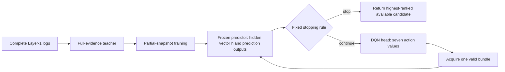

# Reinforcement learning, then our adaptive acquisition task

This is an onboarding lesson for an AI engineer who knows supervised learning but is new to reinforcement learning (RL). Read Parts I and II in order. Part I explains the algorithm independently of this project. Part II maps every part to the code and notebook.

## First, locate the RL work

There are two different notebook pipelines in this repository:

| File | Job | RL? |
|---|---|---|
| [`merging_finetuning.ipynb`](merging_finetuning.ipynb) | QLoRA fine tuning for binary solution fusion, then controlled fusion evaluation | No RL stage in the current notebook |
| [`adaptive_analogical_training_kaggle.ipynb`](adaptive_analogical_training_kaggle.ipynb) | Learn to rank candidates from partial evidence and decide what evidence to acquire next | Yes: Stage 3 trains a DQN acquisition head |

The two pipelines both concern mathematical candidate solutions, which makes them easy to mix up. The RL implementation discussed below is in the adaptive notebook and its matching Python module, [`adaptive_analogical_training.py`](adaptive_analogical_training.py). The existing [`ADAPTIVE_ANALOGICAL_TRAINING_GUIDE.md`](ADAPTIVE_ANALOGICAL_TRAINING_GUIDE.md) provides a detailed account of the whole adaptive data and model pipeline. This lesson starts earlier, with the RL concepts themselves.

## Part I — RL from first principles

### 1. Why a sequential decision problem needs a different objective

In ordinary supervised learning we have examples `(input, label)` and train a model to predict the label. The prediction itself usually does not change the next input. In RL, an **agent** chooses an action, the **environment** changes, and the agent sees a new observation. Its current choice can affect both its immediate cost and the quality of later choices.

For example, an agent deciding which medical test to order might pay for a test now to improve a later diagnosis. A test with no immediate diagnosis benefit can still be valuable because it changes what is known. Our task has the same structure: an acquisition can expose a useful candidate or reveal evidence that makes a bad candidate look less credible.

One run from start to finish is an **episode**. Its ordered observations, actions, and rewards form a **trajectory**:

```text
observation o0 -> action a0 -> reward r1, observation o1
               -> action a1 -> reward r2, observation o2
               -> ... -> terminal result
```

The **policy** is the decision rule `π(a | o)`: given what the agent currently sees, choose an action. The training objective is to maximize expected total reward over episodes, not merely win the next step.

### 2. State, observation, and partial observability

The environment's full **state** contains everything needed to describe reality. An agent's **observation** contains only what it is allowed to see. In a fully observed Markov decision process (MDP), the present state is sufficient for predicting the next state and reward after an action. In a partially observed setting (POMDP), the agent sees an incomplete view and may need a history or belief about hidden information.

This distinction is central here. The cached record contains the complete candidate and evaluation pool, but the agent sees only acquisitions already made. Hidden correctness labels and unacquired CCS measurements must never appear in its input. The code uses the current partial snapshot and a frozen neural representation as a practical summary of its observation. It does not maintain an explicit probabilistic belief or recurrent memory.

### 3. Reward and return

The environment supplies a **reward** after an action. An episode's **return** from time `t` is

```text
G_t = r_(t+1) + γ r_(t+2) + γ² r_(t+3) + ...
```

`γ` (gamma) is the discount factor. Values below 1 favor earlier reward. At `γ = 1`, all future rewards in a finite episode receive equal weight. A useful reward design must represent the actual goal. If we reward only “number of acquired signals,” an agent may buy unnecessary evidence. If we reward only a confidence score, it may become confidently wrong. In our project, reward is tied to the correctness of the **answer actually returned** and to acquisition cost.

### 4. Value functions and Q-values

`Vπ(o)` means the expected remaining return from observation `o` when following policy `π`. `Qπ(o, a)` means the expected remaining return if we first take action `a` and then follow `π`. A Q-value is a utility estimate, **not a probability that an action is correct**.

If we knew the optimal action values `Q*`, we could choose

```text
π*(o) = argmax over valid a of Q*(o, a).
```

We usually do not know them. Q-learning estimates them from experience. A costly information-gathering action can have a high Q-value when it enables better later decisions.

### 5. Bellman backup: how a later result teaches an earlier choice

For a transition `(o, a, r, o', done)`, the one-step Q-learning target is

```text
y = r                              if done
y = r + γ max_valid_a' Q(o', a')   otherwise.
```

The model's current estimate `Q(o, a)` is moved toward `y`. The difference `y - Q(o, a)` is the **temporal-difference error**. Repeated backups move terminal reward backward through earlier information-gathering actions.

Tiny example: ordering an evaluator costs `0.01` reward units. After seeing its result, the best next action has estimated value `0.82`. With `γ = 1`, the earlier action's target is `-0.01 + 0.82 = 0.81`. Its immediate reward was negative, but its expected total value is high.

The `max` in this target assumes a good continuation from the next observation. That is why Q-learning can learn useful multi-step choices instead of optimizing only the next reward.

### 6. From a Q-table to a deep Q-network

A small toy problem can store one Q-value per `(state, action)` in a table. Our observations are feature vectors, and many partial snapshots are possible. **Deep Q-learning (DQN)** replaces the table with a neural network `Qθ(o, ·)` that outputs one real number per discrete action.

Training minimizes a loss between its selected-action output and the Bellman target:

```text
loss = Huber( Q_online(o, a), y ).
```

Only the Q-value for the action actually taken is directly fitted by that transition. Other action values are learned when those actions are tried in other transitions. DQN is suitable here because there are few discrete acquisition choices.

### 7. Exploration, replay, and a target network

At the start, Q-values are untrained. Always taking the currently highest value can prevent the agent from discovering better actions. **Epsilon-greedy exploration** chooses a random *valid* action with probability `ε`; otherwise it takes the highest-valued valid action. In training, `ε` declines as experience accumulates. During greedy evaluation it is zero.

DQN stores transitions in a **replay buffer** and trains on randomly sampled minibatches. Replay reuses experience and mixes consecutive steps from different questions. It does not create new outcomes or compensate for actions never observed.

The Bellman target also contains a Q-network prediction. Updating that prediction with the same network on every step can make learning unstable. DQN therefore keeps an **online network** that receives gradient updates and a **target network** copied from the online network periodically. The target network supplies a temporarily stable future-value estimate.

Standard DQN uses `max_a Q_target(o', a)` to choose and value the next action. **Double DQN** uses the online network to choose `argmax_a Q_online(o', a)` and the target network to value that selected action. This can reduce overoptimistic estimates. Both variants still require valid-action masking.

### 8. What “off-policy” means here

Q-learning is **off-policy**: it can learn toward a greedy target while the behavior collecting transitions uses epsilon-greedy exploration. This is useful because training can explore, while evaluation uses a deterministic greedy policy.

There is a separate issue with a *fixed historical dataset*. If records contain only one old trajectory, many alternative actions have no outcomes. A Q-network can assign arbitrary values to those unsupported actions. Our cached simulator needs complete recorded alternatives for each supported action and masks actions outside that support. Even then, its conclusions depend on the recorded prompt and generation procedure being compatible with a different acquisition order. It cannot infer results for brand-new prompts, models, candidates, or interactions absent from the logs.

### 9. A minimal generic DQN loop

```python
online = QNetwork()
target = copy_of(online)
replay = ReplayBuffer()

for step in training_steps:
    valid = environment.valid_actions()
    action = random_valid(valid) if explore() else argmax_valid(online(observation), valid)
    next_observation, reward, done = environment.step(action)
    replay.add(observation, action, reward, next_observation, done,
               environment.valid_actions())

    if replay.is_warm:
        batch = replay.sample()
        future = zero_for_terminal_else_max_valid(
            target(batch.next_observation), batch.next_valid, batch.done)
        y = batch.reward + gamma * future
        fit_selected_action_q(online, batch, y)

    if time_to_sync_target:
        target.load_state_dict(online.state_dict())
    if done:
        environment.reset_to_new_episode()
```

The real code also uses a frozen encoder, cost accounting, development evaluation, and checkpoint selection. We map those next.

## Part II — Map RL onto our task

### 10. The task in one sentence

For a target math question, choose a correct existing or newly acquired candidate answer while spending fewer candidate-generation and CCS evaluation calls than acquiring the complete pool.

The cached Layer-1 record contains three zero-shot candidates, five one-shot candidates linked to five retrieved sources, five evaluator problems with known answers, Base-CCS values, a candidate-by-evaluator CCS matrix, and offline correctness labels. Base-CCS measures the solver's success on an evaluator without a candidate demonstration. CCS measures success with a candidate as an analogical demonstration. The goal is to use the partial pattern of these measurements to pick an answer and decide what to measure next.

The pipeline has three learned pieces:



The teacher and snapshot predictor use supervised learning. Only the small acquisition head uses RL. The DQN does not generate mathematical text, decide correctness directly, or change the stopping rule.

### 11. Why the supervised stages come before RL

The complete-pool teacher learns candidate correctness scores. Its rankings plus known offline labels define retrospective **SAFE** and **MAX** targets. SAFE is the leading prefix in teacher ranking for which every candidate is actually correct; MAX marks the first ranked candidate when that prefix is nonempty. These labels are training targets for the snapshot predictor, not guarantees available at deployment and not the DQN reward.

The snapshot model is trained on partial records. Its input includes candidate/retrieval/evaluator masks, observed similarities, Base-CCS and CCS, missing/attempted masks, acquisition cost, and remaining budget. Under the current default configuration this input has **223 features**. It produces a 128-dimensional final hidden vector `h` and **26 prediction outputs**: three eight-candidate blocks plus two global SAFE/MAX indicators. Candidate correctness scores rank the available answers; the other outputs support configured stopping. Temperature calibration is fitted on development data; stopping thresholds are configurable and should be assessed there before the audit.

Before RL begins, the snapshot model is switched to evaluation mode and its parameters are frozen. The DQN head sees `h`, **not the prediction-output vector**. The application still reads those prediction outputs to select an answer and apply the stop rule. The action mask is supplied separately from the network output.

### 12. Exact RL vocabulary for this code

| General RL term | Concrete project meaning |
|---|---|
| Agent | `ActionHead`, a `128 -> 64 -> 7` neural network by default |
| Environment | `CachedEnvironment` for one complete historical question record |
| Hidden world state | Full cached candidates, CCS outcomes, and correctness labels |
| Agent observation | Current acquired snapshot encoded as frozen vector `h`; action validity supplied as a mask |
| Action | Add the next evaluator, next zero-shot candidate, or a one-shot candidate from an active source |
| Reward | Negative incremental acquisition cost; on termination add correctness of returned candidate |
| Episode | One question from initial `ZS1 + R1` until confidence, budget, or pool exhaustion stops it |
| Policy | Greedy valid-action Q selection at evaluation; epsilon-greedy valid selection during training |
| Terminal decision | The fixed application stop rule, not an action learned by DQN |

The full cached record is used by the environment to reveal outcomes and grade terminal reward. It is not passed to the action head. `observation()` indexes only acquired values.

### 13. What the seven outputs mean

| Index | Acquisition |
|---:|---|
| 0 | Activate the next evaluator in retrieval order |
| 1 | Reveal the next zero-shot candidate in its stored order |
| 2–6 | Reveal the one-shot candidate for retrieved sources 1–5, respectively |

These are **bundled** actions. Activating an evaluator reveals its baseline probes and CCS measurements against all currently acquired candidates. Adding a candidate reveals its generation result and CCS measurements against all active evaluators. Activating an evaluator does not automatically create that evaluator's one-shot candidate.

The one-shot action for a source is valid only after its evaluator is active and if that candidate has not already been acquired. Actions are also invalid if the relevant pool is exhausted or if the resulting total cost would exceed the budget. Invalid outputs can still have numeric network values, but they are excluded from random exploration, greedy choice, and the Bellman future maximum. On the initial `ZS1 + R1` snapshot, actions 0, 1, and 2 are structurally possible, subject to budget; actions 3–6 require more activated evaluators.

### 14. Cost and reward with actual numbers

With `n` acquired candidates, `k` active evaluators, and `m = 5` attempts per probe, the default solver-call accounting is

```text
C(n, k) = n + m * k * (n + 1).
```

The initial state has `n = 1`, `k = 1`, so it represents **11 solver calls**. The complete `n = 8`, `k = 5` pool costs **233 solver calls**. If `cost_unit = "total_calls"`, the code also counts one grading call per probe output; the complete pool then costs **458 total calls**. These are accounting units for recorded bundles, not measured wall-clock time or provider prices.

From the initial state, adding an evaluator costs `m * (n + 1)` solver calls; adding a candidate costs `1 + m * k`. The environment computes the exact cost as `C(next) - C(current)` and returns

```text
step reward = -cost_weight * incremental_cost / full_pool_cost
              + [1 if the episode ends and the returned answer is correct, else 0].
```

Defaults: `cost_weight = 0.20`, `gamma = 1.0`, and a full-pool budget unless `max_cost` is configured. For example, adding evaluator 2 at the initial state costs 10 solver calls, giving `-0.20 * 10 / 233 ~= -0.0086`. If a later action ends the episode with a correct answer, that transition also gets `+1`.

**Accounting nuance:** the initial 11 calls are already spent before the first RL choice. Summing `CachedEnvironment.step()` rewards gives `correct - 0.20 * (final_cost - 11) / 233`. The reporting function's `utility` uses `correct - 0.20 * final_cost / 233`. Every policy starts from the same initial state, so this fixed difference does not change which policy is preferred for a given question, but the two numbers should not be called exactly identical.

### 15. The actual transition and Bellman update

For one RL step, `CachedEnvironment.step(action)` checks validity, advances the acquisition state, asks the frozen predictor to encode the new partial snapshot, applies the fixed stop rule, and computes reward. Replay stores

```text
(h, chosen_action, reward, next_h, terminal_flag, next_valid_action_mask).
```

`bellman_target()` uses the target head on `next_h`, masks impossible next actions, and sets future value to zero for terminal transitions. The online head's value for the chosen action is fitted to that target with Huber loss. A nonterminal transition with no valid next action is treated as an error; the stopping rule should have ended the episode at budget or pool exhaustion.

Default training uses **standard masked DQN** (`double_dqn=False`), not Double DQN. Setting `double_dqn=True` changes only how the future action is chosen for the target. The head architecture remains the same. The current defaults use 20,000 environment steps, a 50,000-transition replay capacity, 1,000-step warmup, minibatches of 64, target copies every 500 optimizer updates, and development evaluation every 1,000 environment steps. Epsilon falls from 1.0 to 0.05 over the first 30% of steps. The best head checkpoint is selected by development **utility**. These are starting hyperparameters, not evidence that RL is better than the baselines.

The frozen snapshot model is checked tensor by tensor after RL training. If it changed, the code raises an error. If every policy-training question already satisfies the stop rule in the initial state, there is no acquisition decision to learn and training raises an error.

### 16. One complete hypothetical question

This illustrates mechanics; the candidate outcomes and predictions are invented.

1. Start with zero-shot candidate `ZS1` and evaluator `R1`. Cost is 11 calls. The predictor ranks `ZS1` but the configured SAFE stop condition is not met.
2. The DQN compares valid Q-values and chooses action 0, “add next evaluator.” The environment reveals `R2` baseline and `ZS1`-with-`R2` probes. Cost rises by 10 to 21. The new evidence lowers confidence in `ZS1`.
3. The application still does not stop. The DQN now chooses action 3, “generate/reveal one-shot candidate from source 2.” This is valid because `R2` is active. With two evaluators active, its incremental cost is `1 + 5 * 2 = 11`; total cost becomes 32.
4. The predictor now ranks the new candidate first. Suppose the fixed SAFE rule fires. The application returns that candidate. If the offline correctness label says it is correct, the terminal step receives `+1` in addition to its cost penalty.
5. DQN backups can assign positive value to the earlier `R2` acquisition because it enabled the useful later action, despite its immediate negative reward.

If the stop rule never fires, acquisition continues until no budget-valid action remains or the pool is complete. The application then returns its highest-ranked available candidate. The DQN is not allowed to choose a “stop” action.

### 17. Where the data go, and how to read the notebook

The default `Config` points to a Numina-Hard run log for training and four external run logs for reporting. Eligible complete records from the training log are divided into **supervised 60%**, **policy 20%**, **development 10%**, and **internal audit 10%**. The supervised role trains the teacher and snapshot model. The policy role supplies RL episodes. Development selects settings/checkpoints. Audit is reserved for reporting. External logs are reported separately; no external benchmark becomes a new RL episode during training.

Read these pieces in this order:

1. Notebook **Stage 0** and `Config`, `parse_record()`, `split_records()`: understand which complete records are eligible and how question roles are separated.
2. Notebook **Stages 1–2**, `teacher_labels()`, `build_snapshots()`, `FrozenPredictor.predict()`: understand the supervised evidence representation and why `h` is frozen.
3. Notebook **Stage 3**, `State`, `valid_actions()`, `CachedEnvironment.step()`: understand what the agent can change and what one action reveals.
4. `ActionHead`, `Replay`, `bellman_target()`, `fit_dqn()`: connect the generic DQN loop to the exact implementation.
5. Notebook **Stage 4**, `rollout()`, `policy_report()`: see how the learned policy is compared with fixed alternatives.

The notebook is self-contained for Kaggle; the `.py` module mirrors its implementation for easier code inspection and local tests. Stage 3 is run by `WORK.train_rl()`, after `WORK.prepare()`, `WORK.train_teacher()`, and `WORK.train_snapshot()`. Reporting uses `WORK.report()`. A saved `inference_bundle.pt` contains the frozen predictor and learned head, but using it for live provider calls still requires a compatible external executor.

### 18. What would count as success

Compare RL with evaluator-first, candidate-first, random, and cheapest-next-action policies under the **same** frozen predictor, stop rule, and budget. The full-snapshot policy is a complete-evidence reference; if the adaptive budget is below full cost, it lies outside that cap. The main practical outcome is **selected-answer Top-1 accuracy versus mean and tail acquisition cost**, together with confident-stop errors and forced-stop frequency. A low cost is unhelpful if answer accuracy collapses.

Inspect `results.json` for aggregate reports and `final_trajectories.jsonl` for question-level selected answers, costs, stop reasons, and RL action traces. A high Q-value alone is not experimental success. A single successful hypothetical trajectory is not evidence either. Compare policies on the same eligible questions and report uncertainty for accuracy differences. Audit/external performance must stay separate from development tuning; earlier benchmark use is not erased by a new split.

This notebook evaluates **cached acquisition** from recorded complete pools. It does not validate live API execution, changing prompts, unrecorded alternatives, actual runtime, or clinical/real-world reliability. SAFE/MAX labels are retrospective and their predicted probabilities are not certainty guarantees. The code's local tests check mechanics such as masks, targets, and freezing; a full Kaggle run is needed to learn whether the policy improves the measured task.

### 19. Common confusions to clear up

- **Is the teacher the RL agent?** No. It scores complete evidence and creates supervised targets. The action head is the RL agent.
- **Does the DQN see the prediction outputs?** No. Its learned input is the frozen final hidden vector `h`; the application separately uses prediction outputs for ranking and stopping.
- **Are the seven outputs probabilities?** No. They are estimated remaining returns in reward units.
- **Does the DQN decide to stop?** No. Stopping is application controlled by selected mode, thresholds, budget, and pool exhaustion.
- **Is SAFE or MAX the RL reward?** No. Reward uses the correctness of the answer actually returned plus cost penalties.
- **Can the simulator produce any future candidate?** No. It can reveal only recorded outcomes for supported actions. It cannot supply counterfactual text or probes that were never logged.
- **Why not label the best next action using hindsight?** That would expose future correctness information unavailable at decision time and would miss actions whose value appears only after another step.
- **Does a good cached result prove a live improvement?** No. Live prompts, model behavior, API failures, costs, and new candidate outcomes need separate validation.

### 20. A compact mental model

> The supervised predictor tells us what the current evidence suggests. The fixed application rule decides whether that evidence is enough to answer. If more evidence is needed, the DQN estimates which affordable acquisition has the best expected effect on eventual answer correctness after paying for it.

That sentence is the whole architecture. The technical details above exist to make each of those three decisions trainable, measurable, and auditable.
