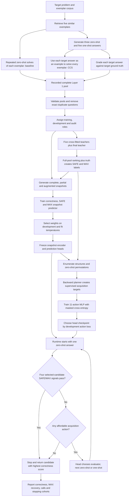

**Decision-head training and dataset audit — 5 October 2026**

The code contains several real mismatches between the supervised decision dataset and the policy that is deployed in the simulator. The change associated with `use_test_files_for_dev_and_audit=True` also altered much more than validation membership. It changed training membership, the relationship between the snapshot model and the decision head, the teacher used to define validation targets, and the population reported as the audit.

My strongest explanation is a combination of changed upstream stopping behavior and a new in-sample/out-of-sample mismatch in decision training, amplified by a decision objective that does not select for actual deployment calls. I verified mechanisms and constructed counterexamples. I cannot identify the measured cause of this particular run without its old/new configurations, results, and checkpoints. The repository does not contain those real runs.

This report distinguishes **confirmed code behavior**, **reproduced defects**, and **plausible explanations of the reported regression**. The probes are synthetic, offline checks of semantics. No provider calls, new full training run, or Kaggle benchmark execution were performed. Training code and notebook behavior were left unchanged.

**1. What was inspected and what changed**

The inspected checkout is `analogical_math_rag`, branch `analogical-consistency`, at HEAD `6316fca`. The adaptive training module had no uncommitted changes. Unrelated merging changes and existing audit artifacts were present; they were preserved while the audit evidence was independently rechecked. I traced the active module, embedded notebook, upstream Layer 1 generation and grading, tests, and the relevant Git history.

| Code version | Teacher and snapshot training | Decision-head training | Development | Audit |
|---|---|---|---|---|
| Immediately before `8dfe84f`, revision 3 | 60% of eligible Numina questions | Separate 20% of eligible Numina questions | Separate Numina 10% | Separate Numina 10%; external benchmarks reported separately |
| `8dfe84f` onward, flag true | Every eligible Numina question | The same questions as teacher/snapshot | All eligible configured external questions pooled | Exactly the same pooled questions as development |
| Current code, flag false | Shared Numina 80% | The same shared 80% | Separate Numina 10% | Separate Numina 10%; external benchmarks reported separately |

`8dfe84f` was committed on 3 October. It added the flag and shared training, advanced the pipeline revision, added fixed acquisition comparisons, and expanded call reporting. `7d7a16e` refined MAX-stop tracing and correct/wrong/other savings reporting. Later commits added logging, compression, batching, caching, and resumable head training. Checked-in performance reports for those optimizations describe synthetic speed/equivalence checks, not improved policy quality.

The learned policy already checked all four SAFE/MAX signals at the initial state and after acquisitions in `db4a81b`, before the flag. The numerical acquisition-cost formula also remained equivalent. AST comparison across `db4a81b`, `8dfe84f`, and `7d7a16e` found unchanged implementations of `teacher_labels`, `fit_teachers`, `goal_condition`, `aggregate_decision_rows`, `build_decision_rows`, `fit_snapshot`, and `observation`. Therefore the planner defects below are pre-existing weaknesses exposed by a changed training distribution, not defects first introduced by this Boolean. The later optimizations changed implementation details; current parity tests and synthetic reports support their intended equivalence.

**Setting the flag false today does not restore the previous algorithm.** The decision role still aliases the snapshot training role, and Stage 3 explicitly requires that equality. Historical comparison must use the historical split, or a controlled implementation of that split. See [split construction][split] and [Stage 3 training][train3].

The module and notebook agree: AST comparison found all 111 function/class definitions identical; both use revision 4. The notebook contains no saved execution outputs. This rules out checked-in module/notebook drift; it does not verify the definitions or configuration already loaded in a running Kaggle kernel.

No paired real before/after adaptive run logs, checkpoints, `results.json`, or final trajectories were found in the inspected repository artifacts. The user's old approximately 1.5-call result and current worse result therefore remain unverified measurements, not numbers recovered by this audit. A running Kaggle session and files elsewhere were not inspected.

**2. The complete flow and its intended philosophy**



The intended idea is sensible: record an expensive complete pool once; teach a local predictor to judge partial evidence; imitate a planner that acquires evidence economically. All later acquisition is simulated from cached historical outcomes. The supervised fine tuning here trains small neural networks; it does not fine tune the answer-generating language model.

**2a. Layer 1 produces the raw supervision**

For the adaptive defaults there are eight candidates: three zero-shot answers and one answer generated with each of five retrieved exemplars. Retrieval supplies similarity and source ordering. One-shot generation uses the source's question/solution as an example; zero-shot generation solves the target without that example.

Each retrieved exemplar has an intrinsic baseline: repeatedly solve that exemplar without the target candidate as an example, then grade the solution. This estimates how easy that exemplar is for the solver. The CCS matrix repeats the solve with the target problem and one candidate solution provided as an example, asking the solver to solve the retrieved exemplar. The target candidate's transfer behavior may help rank it even when its own correctness cannot be checked at deployment. CCS measures this transfer signal, not direct proof that the target answer is correct.

Separately, each target candidate is graded against the target's known answer to create a Boolean correctness label. These target truth labels are offline supervision/audit information; they are not runtime features. Relevant code: [Layer 1 generation][layer1], [baseline and CCS trials][measure], [grader dispatch][grader].

**2b. Importing and filtering the data**

`parse_record()` requires the configured number of retrieved sources, exactly the configured number of zero-shot candidates, and exactly one one-shot candidate per source. It sorts sources by descending similarity and moves their one-shot rows consistently. It requires successful generation with nonempty answer text, successful Boolean target grading for every candidate, complete numeric baseline/CCS entries, finite values, valid ranges, and a rate grid compatible with `repeats`.

Under defaults, that means eight successfully generated/graded target answers, five baseline rates, and forty CCS rates per eligible question. An incomplete pool is excluded as a question, rather than becoming several partial training examples. Exclusion reasons are counted. This is useful for a complete-pool simulator, but selection can favor questions and providers that succeeded at every step.

Question identity is a hash of case-folded text with normalized whitespace. Loading reads the training file first, then external files; later identical questions are excluded, so training wins exact overlaps. This protects against exact question leakage. It does not establish absence of near duplicates, shared solutions, or retrieval-corpus contamination. No stratification by difficulty, correct-pool prevalence, or candidate type is applied to the random Numina partition. See [import and eligibility][parse].

**2c. Stage 1: reference ranking and teacher cross-fitting**

The teacher is a residual MLP with BatchNorm and dropout. Its input is a 223-value partial observation, and its output is eight correctness logits. Teacher training uses the same snapshot builder used in Stage 2, including a complete state and sampled/augmented partial states. Only present candidates contribute to binary cross entropy; each snapshot normalizes by its number of present candidates. Adam trains the network, and full-pool validation average precision chooses the checkpoint.

Five-fold cross-fitting gives each supervised question scores from a teacher that did not use that question for fitting or checkpoint selection. Within each fold, the other four folds are split again: 80% fitting, 20% validation. With five approximately equal folds, each fold teacher fits about 64% of the shared training questions. The held-out fifth receives out-of-fold scores.

A final teacher then fits the whole supervised role and selects its weights using the development role. It scores all records. Scores for supervised rows are overwritten with their out-of-fold values. The fold models are not an inference ensemble. This design prevents teacher memorization from directly defining downstream labels on the teacher's training rows. See [teacher fitting and labels][teacher].

**2d. SAFE and MAX are teacher-dependent retrospective labels**

Sort the full-pool teacher scores, using one-shot retrieval order before zero-shot order to resolve exact ties. SAFE consists of the initial uninterrupted sequence of actually correct answers. Stop marking SAFE at the first incorrect answer. If that sequence is nonempty, MAX marks only its first candidate.

For example, ranked truth `[correct, correct, wrong, correct]` gives SAFE `[1,1,0,0]` in ranking order and MAX `[1,0,0,0]`. Ranked truth `[wrong, correct, correct]` gives all-zero SAFE and MAX, although the pool contains correct answers.

Thus MAX means the teacher's highest-ranked candidate was correct and identifies that candidate. It does not mean every correct pool contains a MAX, or that MAX is an objectively unique strongest mathematical solution. In fact, `maximum.any()` is equivalent to correctness of the teacher's first-ranked candidate. Teacher AP checkpoint selection and teacher Top-1 correctness are different objectives.

When the teacher changes, MAX identity, MAX prevalence, and SAFE prefix length can change. Exact-MAX recovery across runs consequently uses a moving reference unless a common teacher is fixed. Target-answer correctness remains the more stable comparison when candidate logs are held constant.

**2e. Stage 2: recognize correctness and SAFE/MAX from partial evidence**

The 223 inputs consist of candidate presence (8), candidate source indicators (48), slot ordinals (8), retrieved/evaluator masks (10), similarity and its mask (10), baseline and observed/attempted masks (15), CCS plus observed/attempted masks (120), and four cost/coverage context values. Neither problem text nor answer text nor their embeddings enters the model. Missing entries are zeroed and accompanied by masks, so an unobserved measurement is distinct from an observed zero.

There are two state types. Runtime `State` assumes each activated evaluator has its baseline and all current candidate cross measurements. Training `SnapshotState` separates retrieval, evaluator activation, attempted calls, and observed calls. That richer state supports missing measurements, failed calls, and training-only source masking. A one-shot requires its source evaluator at runtime.

Defaults generate 24 snapshots per training question per epoch: one unaugmented complete state, twelve rotating runtime-reachable states, and eleven broader coherent structures. All noncomplete samples then undergo candidate/evaluator masking; measurement masking occurs with probability 0.25 and slot permutations with probability 0.10. The default candidate/evaluator masking probabilities are each 0.25. A removed evaluator sometimes leaves its one-shot visible through the conditional `hidden_source_fraction` mechanism; this is training augmentation, not a new runtime action. Measurements are hidden, not numerically invented. The complete sample stays unchanged.

Stage 2 predicts 26 logits: eight correctness, eight SAFE, eight MAX, one global SAFE-presence and one global MAX-presence. Candidate labels are supervised only where the candidate is present. Global targets indicate whether the partial state's present candidates contain any teacher-defined SAFE/MAX member. The correctness loss has weight 1; each auxiliary SAFE/MAX block and the two global terms use `auxiliary_weight=0.25`.

Writing each candidate block loss as the mean BCE over present candidates, the exact objective is `L_correct + 0.25 * (L_SAFE + L_MAX + L_global_SAFE + L_global_MAX)`. Stage 1 uses only `L_correct`; Stage 3 uses `-sum_a target[a] * log_softmax(masked_action_logits)[a]`. These are three distinct objectives, and none is directly the mean number of calls at a required final-answer accuracy.

The selected checkpoint maximizes sampled-development correctness Top-1, breaking ties by lower correctness Brier score. SAFE/MAX quality and call cost do not participate in checkpoint selection. Five positive temperatures are subsequently fitted by development NLL: one shared across each candidate block, and one for each global logit. The whole encoder and all prediction heads are frozen before Stage 3. See [observations][observation], [snapshot generation and selection][snapshot].

**2f. Stage 3: how the decision fine-tuning dataset is constructed**

There are eleven acquisition actions: activate any of five evaluators; generate the next zero-shot; generate a one-shot from any of five activated evaluators. There is no STOP action. Valid-action masks enforce source prerequisites, prevent duplicates, and enforce the cost budget. Zero-shots are generated in slot order.

Default enumeration covers 1,912 coherent structural states, including states without the runtime's initial ZS1 and nonprefix zero-shot subsets. Only 729 are reachable from the runtime initial state. The code also enumerates all six permutations of the three historical zero-shot candidates. It preserves teacher rank and MAX identity under each permutation, including ties.

For every state/order it computes frozen hidden features, partial probabilities, full-pool probabilities, and retrospective rank-goal flags. For rank zero when historical MAX exists, its goal checks presence of the teacher's top candidate plus that candidate's SAFE/MAX and the two global signals. For other rank goals, optional filters compare partial correctness with lower-ranked candidates' full-pool probabilities, and SAFE membership can require a SAFE signal. These full probabilities and teacher ranks are offline goal construction, not head inputs.

Within a question, scenarios with identical visible observation bytes are grouped. This correctly prevents branching merely because an unobserved zero-shot order is known to the dataset constructor. The monotone acquisition graph is solved backwards. Action value records estimated goal reach, incremental calls to the goal, and steps. The comparison is lexicographic: maximize reach first, then minimize calls, then steps. Tied best actions receive a uniform target distribution. A deterministic tied continuation defines downstream values.

The current goal is the first unmet rank in an uninterrupted goal prefix. Losing an earlier attained goal counts as a failed continuation. States receive explicit COMPLETE, EXHAUSTED, BUDGET, OUT_OF_BUDGET, UNREACHABLE, or ACTION status. Only ACTION rows train the head. COMPLETE means the entire eight-rank prefix is satisfied, not that deployment's MAX stop has occurred. Unreachable examples are documented but removed from training.

Each question is stored as an audit shard with goals, cases, costs, and targets. A compact training companion retains only frozen hidden `h`, target distribution, and valid-action mask. The head is `128 -> 64 -> 11`, with ReLU. Plain masked cross entropy trains it; each question's rows are shuffled, questions are shuffled, and Adam updates minibatch by minibatch. Development loss is summed over all ACTION rows and divided by their total number. The checkpoint with the lowest such loss wins. Neither cost values nor reach/regret are passed to the loss. See [goals][goals], [planner][planner], [head and packed rows][head], [head loss and selection][train3].

**2g. Runtime selection, stopping and reporting**

Runtime begins with ZS1. The snapshot predictor ranks present candidates by predicted correctness. For that selected candidate, global MAX, global SAFE, selected MAX, and selected SAFE must all reach the default threshold 0.50. If they do, execution stops before consulting the action head. Otherwise the head chooses a valid affordable acquisition. At full pool or budget exhaustion, execution stops regardless of MAX recognition. The returned answer is the candidate with highest predicted correctness, not necessarily highest predicted MAX.

All policies, including fixed orders, use the same predicted stop rule. The full-pool reference always acquires the full pool. Evaluation repeats each question's six zero-shot permutations and averages them within question before aggregate metrics, avoiding sixfold question weighting. The report separates all questions, historical-MAX-present questions, predicted-MAX stops, and correct-MAX/wrong-MAX/other savings. Short fixed sequences and budget limits can save calls without recognizing a correct MAX. See [runtime and evaluation][rollout], [summary and diagnostics][summary].

These are recorded-outcome simulations. Their accounting assumes fixed repeated solves and graders per acquired measurement; it is not a count of actual provider retries, cached-call reuse, tokens, or live integration overhead. The adaptive module does not itself call the answer provider to deploy the chosen sequence.

**3. Confirmed issues and why they can hurt call savings**

**3a. The stopping model cannot distinguish questions before an evaluator runs.**

I verified that records with different truth and entirely different measurements have identical observations at all evaluator-free reachable states: ZS1, ZS1+ZS2, and all three zero-shots. Only masks, source slots, and costs are visible then. A fixed deterministic predictor/head therefore follows the same evaluator-free path for every question, regardless of difficulty or the actual answer text.

A small change in learned SAFE/MAX priors can cause a large global behavior change. The probe continues when the four lights are 0.499 and stops when they are 0.501. Enlarging the training set or changing selected snapshot weights can move the prior across this boundary. Then every question stops early, or every question acquires an expensive evaluator. This is a particularly strong explanation mechanism for a sudden jump in calls, but the actual checkpoint signals are needed to confirm it occurred.

Early stopping is controlled by Stage 2. **Retraining the Stage 3 head cannot cause a stop before Stage 2 permits it**, and cannot create a correct recognized MAX when all reachable states fail the four-light intersection.

**3b. The dataset planner and runtime disagree about what attaining MAX means.**

Reproduced counterexample: teacher MAX is slot 0; present correctness probabilities are `[0.60, 0.90]`; slot 0's SAFE/MAX and both global lights are 0.90. The planner marks its rank-zero goal attained. Runtime selects slot 1, whose SAFE/MAX lights are absent, and continues. The training planner can therefore underestimate the cost to an actual stopping state or certify recognition of a candidate deployment does not return.

The current planner also does not model runtime's wrong predicted-MAX termination as a terminal event. A path that would actually stop incorrectly can still be evaluated offline as a path to later teacher-rank goals. Both correct and wrong runtime stops need explicit treatment in an aligned planner.

**3c. Cross-question ambiguity is unresolved, and action labels discard cost regret.**

Visible grouping occurs inside `build_decision_rows()` for one question. Different questions sharing exactly the same observation are optimized separately. That is unavoidable ambiguity at the initial state, but the labels used to resolve it are not cost-aware.

The reproducible probe gives two indistinguishable initial questions the following *remaining* costs to successful MAX recognition; both choices succeed:

| Question | Start with R1 | Start with R2 | Per-question target |
|---|---:|---:|---|
| A | 2 | 4 | R1 |
| B | 7 | 2 | R2 |
| Equal question mixture | 4.5 | 3.0 | R2 minimizes expected cost |

Plain cross entropy learns an equal mixture of the two local labels. Greedy tie resolution chooses R1. Running the actual `rollout()` with the same initial action and optimal subsequent local decisions costs **5.5 solver calls per question**, including initial ZS1. R2 costs **4.0** with the same successful true-MAX stopping. Joint visible-state planning across the two questions chooses R2.

Here the equal mixture is the ideal conditional CE target under equal example weights; the probe does not train a real head to convergence. A fitted network may break that tie either way. The defect established by the example is that CE winner labels do not encode which mistake is more expensive.

This is not just an expensive action chosen through imperfect model fitting: the local classification targets themselves fail to express the better expected-cost decision. The audit shard already stores action cost/reach; packing and loss discard them. More supervised rows do not repair that missing information.

**3d. Shared training removes the former downstream generalization boundary.**

Previously the frozen snapshot model generated Stage 3 representations for a separate policy partition. Those policy questions had not trained the snapshot encoder. Now policy and supervised roles are identical. The snapshot encoder trains on each decision-training question's correctness/SAFE/MAX targets before providing its hidden representation and recognition behavior for that question.

Teacher cross-fitting helps Stage 1 labels but does **not** cross-fit the Stage 2 encoder. Thus head training uses in-sample snapshot behavior while external development/deployment uses unseen-question behavior. If the snapshot memorizes or is overly optimistic, training paths can be easy/short and target actions may generalize poorly. This is a confirmed distribution change and a plausible regression mechanism, not proof of harmful overfitting in the missing runs.

The reference teacher also changed for the decision-training role: the former disjoint policy questions received final-teacher scores; current shared policy questions receive out-of-fold teacher scores. More questions therefore came with a different reference-label generator, not simply more samples of the old distribution.

This does not prove that the new fold teachers are weaker than the old final teacher: the old final teacher fitted approximately 60% of Numina, whereas each new fold teacher fits approximately 64% when all Numina is shared. The issue is changed label provenance and consistency, plus in-sample Stage 2 behavior, not an unsupported claim about relative teacher accuracy. Stage 3 question membership also grows from 20% to 100%, about five times as many questions and optimizer batches per epoch, while Stage 1/2 grow from 60% to 100%.

**3e. The validation objective has very little exposure to the states that determine early calls.**

Default development snapshots are one complete state plus fifteen rotating reachable states per question. An exact sampler probe for a hypothetical 500-question dev set yields 8,000 snapshots: only 11 initial states (0.1375%), 31 evaluator-free states (0.3875%), and 511 full states (6.3875%). Every actual runtime question encounters the initial state.

Snapshot selection further ignores SAFE/MAX metrics entirely. It can select better correctness ranking but worse early MAX recognition. Stage 3 selection minimizes action CE over the entire actionable structural/rank dataset, including post-stop and runtime-unreachable states. There is no guarantee that lower loss means lower calls at comparable accuracy.

Questions with more actionable rows also contribute more Stage 3 development loss. Pooled benchmarks contribute according to eligible questions and generated action rows, while final external macro reporting averages benchmarks equally. These are different selection/reporting objectives.

Unreachable rows contribute no acquisition supervision, although runtime still needs a fallback on those questions. The lexicographic planner also always prefers higher goal reach before considering cost; it has no explicit tradeoff where a small reach gain can be rejected as too expensive. Both choices can be defensible for exact recovery, but neither is automatically optimal for correctness under an API budget.

The labels logically imply that a present selected MAX is SAFE and that global MAX/SAFE are present. The four prediction heads are nevertheless independent logits without that consistency constraint. Their conjunction can reject a correct early stop because any one auxiliary prediction is low. This is another reason to validate the joint stopping event, rather than assuming correctness Top-1 or separate head losses establish reliable stopping. Reweighting rare MAX labels may help recall, but requires held-out calibration because it changes the effective training prior.

**3f. The audit is reused for selection, and the reference labels move.**

With the flag enabled, final teacher selection, snapshot selection, temperature fitting, heuristic selection, and head selection all use the same external questions later reported as audit. This does not inherently force call counts upward. It does remove independent assessment and can select behavior dominated by the largest eligible benchmark. Reporting AIME/GSM8K/MATH500 separately afterward does not undo their use in selection.

Development SAFE/MAX comes from the final teacher, whereas shared training SAFE/MAX comes from fold teachers. Enlarging teacher training and changing final-teacher validation can alter their agreement. Old/new MAX cohorts and identities can therefore differ even on the same question logs. Compare target correctness and fixed-reference MAX metrics, and inspect label prevalence, rather than interpreting a cohort shift as improved/worse acquisition alone.

**3g. Failed measurement calls are encoded as mathematical failures.**

Baseline/CCS tasks initialize `is_correct=False`. If the solve fails or the grader fails to parse/returns unknown, it remains false. The rate divides by all configured trials anyway. Layer 1 wrappers can label the step successful despite these trial failures; adaptive importing accepts the numeric rates. An observed CCS zero can consequently mean poor transfer or infrastructure failure.

This behavior predates the split flag. Moving model selection to separately generated external logs makes differences in provider reliability or grader parsing more consequential. Synthetic missing-measurement augmentation does not repair a real rate already contaminated by failed trials: the importer has lost which zeros were unknown. See [measurement construction][measure].

**3h. Repeat-count and grading provenance are incompletely authenticated.**

Layer 1 stores `MIRROR_N_OPTIMIZATION` in metadata, but the adaptive parser does not inspect it. Its rate-grid check rejects most denominator mismatches; endpoints 0 and 1 pass any repeat count. The audit probe successfully imports a record declaring three repeats under a five-repeat configuration. Its simulated costs and measurement uncertainty are then misrepresented.

If three-trial logs are parsed as five-trial logs, non-endpoint rates are rejected while endpoint-only pools can survive. This can create a selective dataset of extreme rates rather than a clean, uniformly rejected incompatible file. Metadata must be checked before interpreting exclusion counts or training on the surviving rows.

Current general defaults are five zero-shot candidates and three repeats, while adaptive defaults are three zero-shots and five repeats. These defaults may be overridden in real notebooks; the actual logs must decide compatibility. Do not simply copy either set of defaults onto historical files. See [general configuration][config] and [stored metadata][metadata].

Baseline/CCS graders also inherit the **target benchmark's** answer-format dispatch while grading **retrieved exemplar** ground truths. For a Numina rationale corpus and AIME/MATH target, direct-final-answer evaluation is selected for a rationale-form gold unless the data has already been normalized. This is a confirmed entity/format dispatch mismatch; its actual grading effect requires logs. Explicit exemplar answer format should determine this dispatch. See [trial grader calls][measure], [grading format][grader], [benchmark lookup][benchmark].

Layer 1 cache identity/reuse does not fully verify model, prompt, and repeat provenance. Distributed manifest protection may cover specific distributed runs; adaptive importing itself does not authenticate those dimensions. This is an additional source of uncertainty, not evidence that stale caches caused this run.

**3i. Temperature scaling usually cannot change the default stop boundary.**

For positive T, `sigmoid(z/T) >= 0.5` exactly when `z >= 0`. Shared correctness-block temperature also preserves correctness ranking and partial-vs-full comparisons mathematically. Hidden features are temperature-independent. Changing only temperatures normally changes neither default four-light decisions nor rank-goal labels; it cannot generally fix under-recognition at threshold 0.50. An affine calibration bias or tuned threshold can move a boundary, temperature alone cannot.

There is a numerical exception: float32 sigmoid at T=0.25 turns logits `[5,6]` into `[1,1]`, changing an argmax through tie resolution; at T=1 it selects the higher logit. Saturated probabilities can also alter strict rank comparisons. Logit-space ranking/comparison would avoid this. The probe verifies both ordinary invariance and this exception. There is no evidence that saturation was responsible for the reported regression.

**4. Interpreting the old approximately 1.5 calls**

Call accounting is:

```text
measurement solves = repeats * active_evaluators * (present_candidates + 1)
solver calls       = generations + measurement solves
total API calls    = generations + 2 * measurement solves
```

The extra `+1` is the baseline per evaluator. The second measurement term counts grader calls. With default repeats=5:

| State | Generation calls | Solver calls | Total API calls |
|---|---:|---:|---:|
| ZS1 only | 1 | 1 | 1 |
| Two zero-shots, no evaluator | 2 | 2 | 2 |
| ZS1 plus one evaluator | 1 | 11 | 21 |
| Full pool: 8 candidates, 5 evaluators | 8 | 233 | 458 |

Activating an evaluator costs `repeats*(n+1)` solver calls at n present candidates. Generating another candidate costs `1 + repeats*k_active`; total API costs double the measurement component. Actions therefore have very unequal costs. The formula did not change mathematically when call-count reporting was expanded. See [costs][cost].

Under a fixed deterministic model and default complete runtime states, every question follows the same evaluator-free route. Consequently its aggregate mean used cost is either exactly 1, 2, or 3 if that common route stops without an evaluator, or at least 11 solver calls / 21 total calls if it acquires an evaluator. **A literal 1.5 mean used calls is not compatible with this immediate historical/current simulator under those assumptions.**

That does not invalidate the user's observation. It means the metric, configuration, or historical implementation needs identifying. It might be generation-only calls, saved calls, a normalized quantity, or another pipeline. Merely restricting the same deterministic default run to a different question cohort does not remove the evaluator-free invariant. New tables show both solver cost and total API counts; comparing those columns can manufacture an apparent regression. MAX-conditioned savings and overall savings are also different quantities.

Low calls alone are not sufficient evidence of a good head. A prior-only early stop can save almost the full budget while returning the wrong answer or a candidate different from historical MAX. Conversely, a more reliable predictor may correctly reject unsafe early stopping and use more calls. Inspect correctness, predicted-MAX precision, and correct-MAX savings alongside mean cost.

**5. What I would change, in priority order**

1. **Align the planner with the actual terminal rule.** Rank-zero success should require the runtime-selected candidate to be the desired reference candidate and to satisfy the same four lights. Runtime predicted-MAX stops, wrong stops, exhaustion, and budgets must be represented in planner transitions. Preserve later-rank objectives as explicitly auxiliary if they are still scientifically useful.

2. **Preserve cost consequences in supervised learning.** Start by retaining `action_reach` and `action_expected_cost` in packed examples and evaluating a cost-sensitive or value-prediction loss. Do not arbitrarily subtract incomparable probability/call units: first define a correctness/recognition constraint or an explicit scalar utility. For observations that are exactly identical across questions, jointly estimate action outcomes before taking an argmin. For broader ambiguous states, learn conditional expected outcomes/regret rather than copying per-question winners. This directly addresses the reproduced 5.5-versus-4.0 example.

3. **Choose checkpoints using actual rollout quality and cost.** Track target correctness, joint four-light recall/precision, correct-MAX recovery, wrong stops, mean/p90/p95 calls, and budget outcomes per benchmark. Select the cheapest candidate satisfying a predeclared quality requirement, or present a quality/cost frontier. The required precision or allowable accuracy loss is a research choice to establish on held-out data.

4. **Represent early states for every question.** Include the initial state and evaluator-free prefixes explicitly in validation. Train with a mixture of actual rollout states and a smaller structural/stress component. Keep broad coverage, but avoid giving every unreachable/post-stop structure the same importance as the first few deployment decisions. Once exhaustive generation already covers states, trajectory aggregation primarily improves weighting and feedback, not missing-state coverage. This is consistent with the motivation of [DAgger][dagger], which studies learning under the state distribution induced by the learned policy; adaptation here still requires evaluating the actual cost objective.

5. **Restore honest downstream training and evaluation boundaries.** For a simple control, use a separate decision-training question partition as revision 3 did. If shared questions are required, generate out-of-fold snapshot predictions for decision target construction. Do not blindly concatenate hidden vectors from independently fitted fold encoders: their latent coordinate systems need not align. Use canonical raw observations and semantically aligned probabilities, or explicitly align/fix the encoder before combining fold representations. Retain a truly untouched audit and external benchmarks, with development weighting chosen explicitly.

6. **Add cheap question-specific evidence if early adaptation is required.** The current features cannot distinguish any two initial questions. Candidates' normalized final-answer agreement, local answer/question embeddings, and already-computed retrieval similarities could provide useful visible evidence without expensive repeated solver evaluation. Confirm availability and actual token/API cost; benchmark leakage must still be controlled. A separate retrieval-only observation/action would expose cheap similarity without bundling it with baseline and all CCS probes. Compare each added feature against its cost and a zero-shot-only baseline.

7. **Repair raw measurement semantics and provenance.** Store attempted, successful, validly graded, correct, failed, and unknown counts for every baseline/CCS cell. Never silently treat failed infrastructure as mathematical incorrectness. Validate the stored denominator, generation geometry, provider/model/prompt/grader provenance, and answer format before importing or reusing a cache. Use uncertainty from valid trial counts when comparing low-repeat rates. Where historical logs lack those counts, mark evidence quality unknown rather than inventing corrected rates.

8. **Use a stopping objective that matches the research goal.** If the goal is correctness with minimum expected calls, exact teacher-MAX identity can unnecessarily penalize another correct answer and provide no MAX at all when the teacher ranks a wrong answer first. A quality-constrained correctness/value-of-information target may be more suitable. If exact teacher recovery is the intended goal, retain it but report it explicitly and use a fixed teacher when comparing algorithms. Introducing a learned STOP action requires labels and evaluation for mistaken termination; lowering a threshold until calls look good is not sufficient.

Temperature scaling is a useful probability-calibration tool in general, as studied by [Guo et al.][calibration]. Its special limitation at this code's default 0.50 boundary must be considered when choosing a practical stopping calibrator.

A useful supervised objective is to estimate conditional action outcomes from visible evidence, then minimize expected remaining calls subject to a chosen final-answer quality constraint. Another option is an explicit utility combining final error and calls, with the tradeoff chosen before audit evaluation. Cost-sensitive learning-to-search methods such as [LOLS][lols] motivate assessing deviations using downstream outcomes; applying that idea here is a proposed experiment, not a demonstrated improvement on these logs.

**6. Experiments that can identify the cause without another uncontrolled rewrite**

Use immutable logged candidate pools and the same question IDs, zero-shot permutations, cost units, budget, and target grading in every comparison. Use fresh output folders because current artifacts fail closed when configuration/data contracts differ. Do not weaken fingerprint checks to make an old checkpoint load.

| Experiment | Hold fixed | Change | What it resolves |
|---|---|---|---|
| Reproduce old/new reports | Exact evaluation IDs, metrics and candidate logs | Historical/current complete pipeline | Whether there is a comparable regression |
| Validation-membership control | Training IDs, training budget, algorithm | Internal dev versus pooled external dev | Effect of selecting different checkpoints |
| Snapshot-training control | Teacher labels/reference, head protocol, evaluation | Old versus expanded snapshot training IDs | Changes in early lights and unseen representations |
| Decision-membership control | One teacher and snapshot checkpoint, evaluation | Disjoint versus shared head questions | Effect of in-sample snapshot behavior on head learning |
| Terminal-rule repair | Data, predictor, head capacity and optimizer budget | Aligned goals/termination | Impact of planner/runtime mismatch |
| Cost-aware targets | Same repaired states and evaluation | Plain CE versus conditional cost/value targets | Impact of losing action regret |
| State weighting | Same labels and capacity | Exhaustive uniform rows versus rollout/early weighting | Whether early-state policy improves |

The current public configuration cannot express all of these controls: changing the flag changes training membership too, and Stage 3 rejects disjoint policy/supervised roles. An experiment harness or isolated historical version is needed; two flag values alone do not isolate the switch.

For training-size comparisons, keep optimization exposure in view. More questions creates more optimizer updates per epoch; the same epoch count does not mean the same training budget. Match or report updates, rows, patience behavior, and selected epoch.

For each run, recover `contract.json`, `data_audit.json`, `split_manifest.json`, teacher fold provenance and scores, `snapshot_completed.pt`, `decision_label_coverage.json`, head histories, `results.json`, and `final_trajectories.jsonl`. These distinguish real label shifts, failed-pool exclusion shifts, expensive wrong paths, later recognition, changed units, and wrong early stops.

Before retraining, evaluate the first state's four signal margins, selected candidate, and stop/action for every checkpoint. Then count historical MAX presence, reachable **correct** runtime MAX-stop states, initial/early stop frequency, no-MAX pool exhaustion, and per-question action regret. If the snapshot has no reachable correct stopping state for a question, the acquisition head alone cannot solve its early-stop problem.

Use fixed acquisition orders as a diagnostic control. If both fixed and learned policies worsen with the new predictor on identical questions, upstream recognition, labels, or cohort changes are implicated. If fixed orders remain stable but the learned policy worsens, acquisition training becomes the stronger suspect. An old head must not simply be attached to a newly trained encoder: its hidden coordinates may have changed. A head-only comparison must freeze the same predictor for both heads.

For every benchmark and split, add a dataset profile before training: eligible/excluded questions and exclusion reasons; candidate correctness rates by source; positive-pool rate; teacher Top-1/MAX prevalence; SAFE-prefix length; evaluator baseline/CCS distributions and valid-trial counts; initial and early four-light margins; ACTION/UNREACHABLE and target-rank counts; rows per question; duplicate/overlap counts. Report question-level uncertainty over paired call differences and several training seeds. This reveals whether more questions changed the task, whether the planner cannot recognize MAX, and whether a measured difference exceeds training variability.

**7. Validation performed and practical limits**

All 120 collected cases across the three adaptive suites passed in two complementary runs:

```powershell
python -B -m pytest --assert=plain -p no:cacheprovider -q test_adaptive_analogical_training.py test_adaptive_stage3_generation.py test_adaptive_stage3_training.py -k 'not end_to_end_checkpoint'
# 118 passed, 2 deselected in 8.52 seconds

python -B -m pytest --assert=plain -p no:cacheprovider -q test_adaptive_analogical_training.py -k end_to_end_checkpoint
# 2 passed, 78 deselected in 9.57 seconds
```

The second run covers the two end-to-end checkpoint cases excluded from the first. This verifies the three named adaptive suites, not every test in the repository or real policy improvement. Existing tests mainly establish masks, coverage, equivalence, artifact contracts, and resumability; several deliberately preserve the current rank-goal behavior and therefore do not detect the deployment-objective mismatch. The scalar/vector goal tests compare two implementations of the same rule, and runtime selected-candidate tests check a different rule separately; neither establishes planner/runtime terminal equivalence.

The standalone [audit script][probe] and [captured JSON][probejson] reproduce the planner/runtime counterexample, the cross-question cost failure using actual `rollout()`, early observation invariance and threshold cliff, structural counts and dev sampling, temperature invariance/saturation, and acceptance of a mismatched stored repeat count. Their synthetic examples establish that these defects can occur. They do not estimate how frequent the defects were in the user's unavailable runs.

The investigation supports fixing terminal alignment, retaining cost consequences, validating early stopping, and isolating the shared-training change before increasing model size or training epochs. It does not support attributing the measured regression solely to audit reuse, or claiming that one configuration toggle will restore the earlier call savings.

[split]: C:/Users/mostafa/Documents/git_paper_proj/analogical_math_rag/adaptive_analogical_training.py:384
[parse]: C:/Users/mostafa/Documents/git_paper_proj/analogical_math_rag/adaptive_analogical_training.py:282
[teacher]: C:/Users/mostafa/Documents/git_paper_proj/analogical_math_rag/adaptive_analogical_training.py:543
[observation]: C:/Users/mostafa/Documents/git_paper_proj/analogical_math_rag/adaptive_analogical_training.py:830
[snapshot]: C:/Users/mostafa/Documents/git_paper_proj/analogical_math_rag/adaptive_analogical_training.py:1004
[goals]: C:/Users/mostafa/Documents/git_paper_proj/analogical_math_rag/adaptive_analogical_training.py:1217
[planner]: C:/Users/mostafa/Documents/git_paper_proj/analogical_math_rag/adaptive_analogical_training.py:1290
[head]: C:/Users/mostafa/Documents/git_paper_proj/analogical_math_rag/adaptive_analogical_training.py:1443
[train3]: C:/Users/mostafa/Documents/git_paper_proj/analogical_math_rag/adaptive_analogical_training.py:1613
[rollout]: C:/Users/mostafa/Documents/git_paper_proj/analogical_math_rag/adaptive_analogical_training.py:1939
[summary]: C:/Users/mostafa/Documents/git_paper_proj/analogical_math_rag/adaptive_analogical_training.py:2025
[cost]: C:/Users/mostafa/Documents/git_paper_proj/analogical_math_rag/adaptive_analogical_training.py:439
[layer1]: C:/Users/mostafa/Documents/git_paper_proj/analogical_math_rag/src/layer1_base_execution.py:371
[measure]: C:/Users/mostafa/Documents/git_paper_proj/analogical_math_rag/src/pipeline_steps.py:227
[grader]: C:/Users/mostafa/Documents/git_paper_proj/analogical_math_rag/src/evaluation.py:90
[benchmark]: C:/Users/mostafa/Documents/git_paper_proj/analogical_math_rag/src/benchmark_data.py:96
[metadata]: C:/Users/mostafa/Documents/git_paper_proj/analogical_math_rag/src/layer1_base_execution.py:779
[config]: C:/Users/mostafa/Documents/git_paper_proj/analogical_math_rag/config.py:247
[probe]: C:/Users/mostafa/Documents/git_paper_proj/analogical_math_rag/reports/decision_head_dataset_audit.py
[probejson]: C:/Users/mostafa/Documents/git_paper_proj/analogical_math_rag/reports/decision_head_dataset_audit_results.json
[dagger]: https://proceedings.mlr.press/v15/ross11a.html
[calibration]: https://proceedings.mlr.press/v70/guo17a.html
[lols]: https://proceedings.mlr.press/v37/changb15.html
